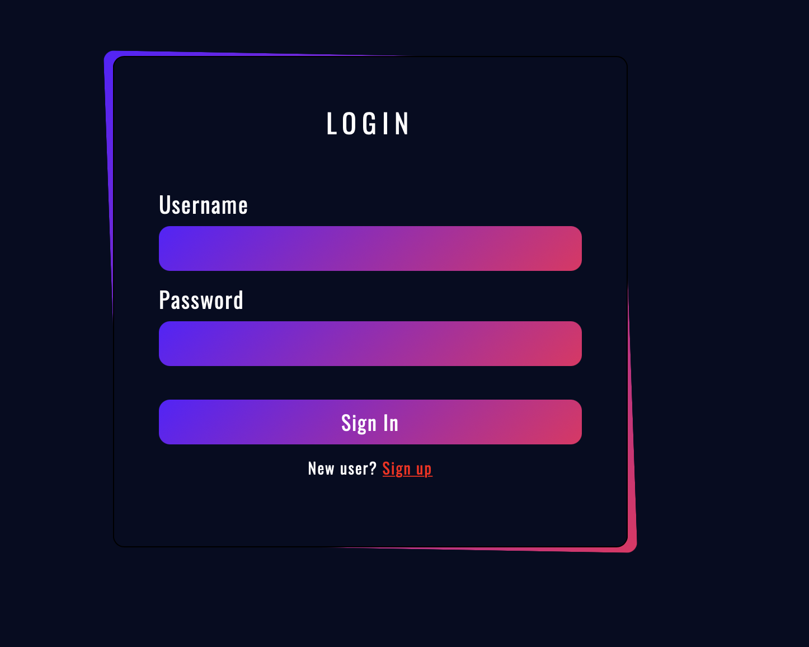
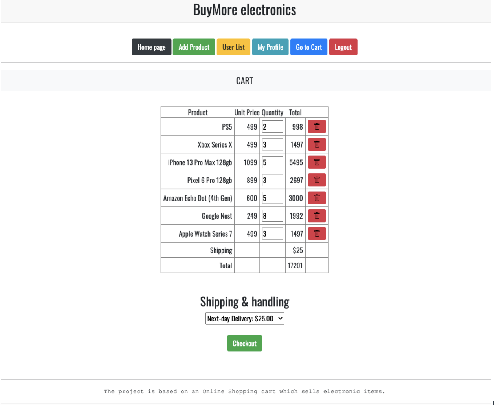

# Shopping_Cart
 

 The project is based on an Online Shopping cart which sells electronic items. There are two main roles who can perform operations on the website. First is the user who can add the products to his cart and further can select the required shipping details and product quantity before he completes his purchase transaction. Next there is a role set for the admin who can do everything that the user can do but additionally the admin can add a new product to the product list in the database, update the product information from the product list, delete a product from the product list, check for any users information in the user list, and also make a transaction of a product in the cart as a user. Additionally the user and admin have access to their profile pages while logged in and there is log out functionality to terminate the session. 

 

<label><b><u> 1) Login Functionality </u></b></label>
 </img>
  

<label><b><u> 2) Sign up Functionality </u></b></label>
 </img>
   

<label><b><u> 3) User-Home page/Product list </u></b></label>
 </img>
 

<label><b><u> 4) Admin-Home page:Product list </u></b></label>
 </img>
 

<label><b><u> 5) Add product page </u></b></label>
 </img>
 

<label><b><u> 6) Profile page </u></b></label>
 </img>
 

<label><b><u> 7) Cart </u></b></label>
 </img>
 

<label><b><u> 8) Purchase successful page (Basically the cart after completing the transaction) </u></b></label>
 </img>
 

# Tech Stack used - 
Front-end : HTML5, CSS3, Bootstrap  
Back-end : JavaScript, jQuery, Node.JS, Express, EJS, MySQL  

Made ✌🏻 by <a href="https://www.linkedin.com/in/guruprem-singh-rajpal-67b486122/"> Guruprem Rajpal </a>
 
Click on Star if you like :)
 
 
 
## License

    Copyright [2021] [Guruprem Rajpal]

    Licensed under the Apache License, Version 2.0 (the "License");
    you may not use this file except in compliance with the License.
    You may obtain a copy of the License at

        http://www.apache.org/licenses/LICENSE-2.0

    Unless required by applicable law or agreed to in writing, software
    distributed under the License is distributed on an "AS IS" BASIS,
    WITHOUT WARRANTIES OR CONDITIONS OF ANY KIND, either express or implied.
    See the License for the specific language governing permissions and
    limitations under the License.

